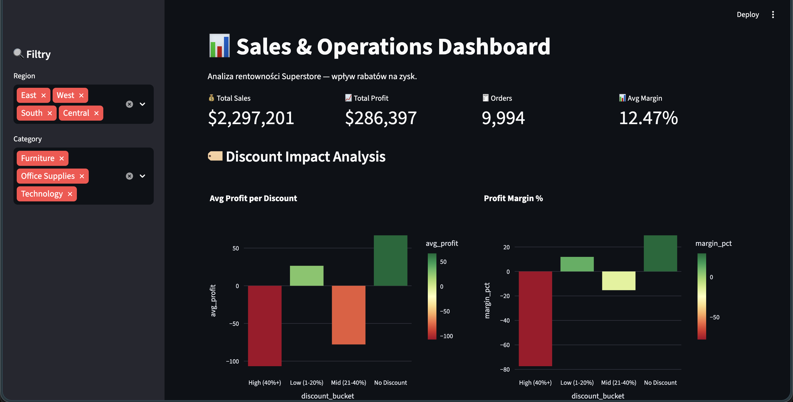

# 📊 Sales & Operations Analytics

Analiza sprzedaży i rentowności sklepu detalicznego (Superstore).  
Projekt pokazuje wpływ polityki rabatowej na zysk firmy — z wykorzystaniem SQL, Pythona i interaktywnego dashboardu.

---

## Problem

Firma odnotowuje rekordowe przychody ($733k w 2017), ale marża zysku **spada**.  
Celem analizy było zidentyfikowanie przyczyn i wskazanie obszarów do optymalizacji.

---

## Dane

| Cecha | Wartość |
|---|---|
| Źródło | [Superstore Dataset — Kaggle](https://www.kaggle.com/datasets/vivek468/superstore-dataset-final) |
| Rekordy | 9 994 zamówień |
| Okres | 2014–2017 |
| Główne zmienne | `sales`, `profit`, `discount`, `category`, `region`, `order_date` |

---

## Kluczowe Wyniki

| Finding | Wartość |
|---|---|
| Wzrost sprzedaży 2014→2017 | +51% ($484k → $733k) |
| Marża przy braku rabatu | 29.5% |
| Marża przy rabacie 40%+ | -77.4% ⚠️ |
| Zamówienia na stracie (rabat 40%+) | 933 zamówień (~$99k strat) |
| Miesięcy poniżej średniego profitu | 27 / 48 (56%) |
| Najsłabsza kategoria | Furniture (mediana profitu ≈ $0) |

---
## Dashboard Preview



---

## Insighty Biznesowe

- 📉 **Rabaty powyżej 40% niszczą marżę** — firma traci średnio $107 na każdym takim zamówieniu
- 🪑 **Furniture** to kategoria z najniższą rentownością — znaczna część zamówień jest poniżej break-even
- 📅 **Silna sezonowość** — Q4 (październik–grudzień) generuje nieproporcjonalnie duże przychody każdego roku
- 📈 **Rosnąca sprzedaż ≠ rosnący zysk** — wzrost wolumenu w 2017 nie przełożył się na poprawę marży

---

## Stack Technologiczny

| Narzędzie | Zastosowanie |
|---|---|
| Python 3.14 | Główny język analizy |
| pandas / numpy | Manipulacja i transformacja danych |
| SQLite + sqlite3 | Baza danych, zaawansowane zapytania SQL |
| matplotlib / seaborn | Wykresy statyczne (EDA) |
| plotly | Interaktywne wykresy |
| Streamlit | Interaktywny dashboard |
| Jupyter Notebooks | Środowisko analizy |
| uv | Zarządzanie środowiskiem Python |

---

## Struktura SQL (showcase)

Projekt zawiera zaawansowane zapytania SQL:
- **CTE** — miesięczny trend z flagą above/below average profit
- **Window Functions** — `RANK() OVER (PARTITION BY region)` ranking klientów
- **Subquery + CASE** — segmentacja zamówień po bucketach rabatowych
- **Widoki** — `monthly_sales` jako reużywalny widok w bazie

---

## Struktura Projektu
sales-analytics/ 

├── data/│   
├── raw/                   # Surowy CSV (Superstore)│   
└── processed/             # Baza SQLite + wykresy PNG
 
├── notebooks/│   
    ├── 01_eda.ipynb           # Exploratory Data Analysis│   
    └── 02_sql_analysis.ipynb  # Zaawansowana analiza SQL 

├── app.py                     # Streamlit dashboard

├── utils.py                   # Funkcje pomocnicze

├── pyproject.toml

└── README.md

---

## Jak uruchomić

```bash
git clone https://github.com/wojtek532/sales-analytics
cd sales-analytics
uv venv && source .venv/bin/activate
uv pip install -e .
streamlit run app.py

```
---

## Notebooki

| Notebook | Zawartość |
|---|---|
| `01_eda.ipynb` | Rozkłady, korelacje, boxploty, trend miesięczny |
| `02_sql_analysis.ipynb` | CTE, Window Functions, discount impact analysis |

---